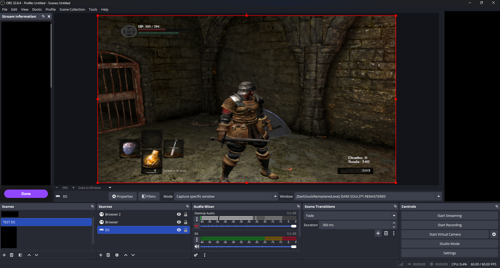
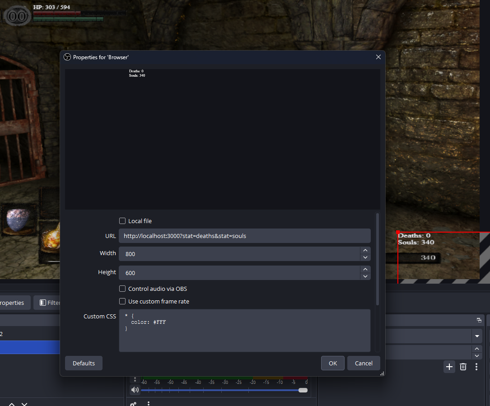

# Dark Souls Remastered — Stream Tracker

A native DLL mod for **Dark Souls Remastered** that reads game memory and exposes player stats through a WebSocket server, designed for live streaming overlays in OBS.

> **Read-only.** The mod never writes to game memory.

---

## How it works

The DLL is injected as a `dinput8.dll` proxy — it loads alongside the game without patching any files, forwards all DirectInput calls to the real system DLL, and runs a background thread that scans for the game's internal data structures and serves them over WebSocket (port 3000 by default, configurable via `dstracker.ini`).

---

## Demo

<!-- Screenshot or GIF of the OBS overlay in action -->


<!-- Screenshot of the OBS Browser Source configuration panel -->


---

## Features

- **DLL proxy** — loads via `dinput8.dll` hijacking, no game files modified
- **Pattern scanning** — finds the player struct at runtime, compatible across patches
- **WebSocket server** — real-time data push, only sends on actual stat changes
- **Configurable port** — set via `dstracker.ini`, defaults to 3000
- **Modular HTTP overlay** — pick which stats to show and in what order via URL params
- **OBS-friendly** — transparent background, fully styled with OBS Custom CSS
- **Initial state push** — new WebSocket clients receive the current state immediately on connect
- **Multi-PC support** — run the game on one machine and capture stats from the streaming PC
- **Graceful shutdown** — clean WebSocket close frames, proper thread teardown on game exit
- **Auto-recovery** — re-scans memory pointers after consecutive read failures

---

## Exposed stats

| URL param | JSON key | Description |
|-----------|----------|-------------|
| `hp` | `hp` / `maxHp` | Current and max HP |
| `fp` | `fp` / `maxFp` | Focus Points (mana) |
| `stamina` | `stamina` / `maxStamina` | Stamina |
| `souls` | `souls` | Current souls |
| `soulsTotal` | `soulsTotal` | Total souls collected |
| `soulLevel` | `soulLevel` | Soul level |
| `deaths` | `deaths` | Death counter |
| `trueDeaths` | `trueDeaths` | True death counter |
| `playTime` | `playTime` | Play time (formatted as H:MM:SS in the overlay) |
| `vit` | `vit` | Vitality |
| `atn` | `atn` | Attunement |
| `end` | `end` | Endurance |
| `str` | `str` | Strength |
| `dex` | `dex` | Dexterity |
| `res` | `res` | Resistance |
| `int` | `int` | Intelligence |
| `fth` | `fth` | Faith |
| `poisonResist` | `poisonResist` | Poison resistance |
| `bleedResist` | `bleedResist` | Bleed resistance |
| `diseaseResist` | `diseaseResist` | Disease resistance |
| `curseResist` | `curseResist` | Curse resistance |
| `ngPlus` | `ngPlus` | NG+ count (0 = first playthrough) |
| `archetype` | `archetype` | Starting class ID |
| `covenant` | `covenant` | Active covenant ID |

---

## Requirements

- Windows 10/11 x64
- Dark Souls Remastered (Steam)
- Visual Studio 2022 or 2026 (for building)

---

## Building

```powershell
.\scripts\build.ps1
```

The script locates MSBuild automatically (via `vswhere` or known VS install paths) and builds a Release x64 `dinput8.dll` into `build\Release\`.

Alternatively, open `DarkSoulsTracker.vcxproj` in Visual Studio and build **Release | x64**.

---

## Installation

1. Build the project (or download a release)
2. Copy `build\Release\dinput8.dll` to your game folder:
   ```
   C:\Program Files (x86)\Steam\steamapps\common\DARK SOULS REMASTERED\
   ```
3. Launch the game — the WebSocket server starts automatically on port 3000

> **Backup** any existing `dinput8.dll` in the game folder before installing.

---

## Configuration

Create a `dstracker.ini` file in the same folder as `dinput8.dll` to customize settings:

```ini
[Server]
Port=3000
```

| Key | Default | Description |
|-----|---------|-------------|
| `Port` | `3000` | WebSocket/HTTP server port |

If the file doesn't exist, all defaults are used.

---

## OBS Setup

### Basic — all stats

Add a **Browser Source** in OBS:

| Field | Value |
|-------|-------|
| URL | `http://localhost:3000/` |
| Width | 400 |
| Height | 300 |
| Shutdown source when not visible | yes |

### Selective — specific stats in custom order

Use `?stat=` params. Order in the URL = render order on screen.

```
http://localhost:3000/?stat=hp&stat=deaths
http://localhost:3000/?stat=deaths&stat=souls&stat=soulLevel
http://localhost:3000/?stat=hp&stat=stamina&stat=fp
```

### Multi-PC setup (game PC + streaming PC)

The WebSocket server listens on all network interfaces by default, so you can run the game on one machine and capture stats from a different PC on the same network:

1. Install the DLL on the **game PC** as usual
2. Find the game PC's local IP (e.g. `192.168.1.50`)
3. On the **streaming PC**, add a Browser Source pointing to the game PC:
   ```
   http://192.168.1.50:3000/?stat=hp&stat=deaths
   ```
4. The WebSocket will connect across the network and update in real time

> **Firewall:** make sure the game PC allows inbound connections on the configured port (default 3000). You may need to add a Windows Firewall rule.

> **Security note:** the server accepts connections from any IP. Only use this on trusted local networks.

### Styling with OBS Custom CSS

The HTML has no embedded styles (only `background:transparent`). Paste your CSS directly into the **Custom CSS** field of the Browser Source.

**Available selectors:**

```css
/* Containers */
#stat-hp, #stat-fp, #stat-stamina,
#stat-souls, #stat-soulsTotal, #stat-soulLevel,
#stat-deaths, #stat-trueDeaths, #stat-playTime,
#stat-vit, #stat-atn, #stat-end, #stat-str,
#stat-dex, #stat-res, #stat-int, #stat-fth,
#stat-poisonResist, #stat-bleedResist,
#stat-diseaseResist, #stat-curseResist,
#stat-ngPlus, #stat-archetype, #stat-covenant { }

/* Parts */
.stat  { }   /* each row */
.label { }   /* "HP: ", "Deaths: " … */
.value { }   /* the number */
.sep   { }   /* " / " between paired values */

/* Individual values */
#hp, #maxHp, #fp, #maxFp, #stamina, #maxStamina,
#souls, #soulsTotal, #soulLevel,
#deaths, #trueDeaths, #playTime,
#ngPlus, #archetype, #covenant { }
```

**Example — deaths counter only, large red text:**
```css
body { margin: 0; }
#stat-deaths { font-size: 48px; font-weight: bold; color: #cc0000; }
.label { display: none; }
```

---

## WebSocket API

Connect to `ws://<host>:<port>/ws` to receive JSON on every stat change:

```json
{
  "hp": 450, "maxHp": 1000,
  "fp": 80,  "maxFp": 100,
  "stamina": 93, "maxStamina": 93,
  "souls": 12500, "soulsTotal": 847300, "soulLevel": 42,
  "deaths": 7, "trueDeaths": 3, "playTime": 18340,
  "vit": 20, "atn": 12, "end": 20, "str": 16,
  "dex": 14, "res": 11, "int": 10, "fth": 10,
  "poisonResist": 87, "bleedResist": 67,
  "diseaseResist": 57, "curseResist": 47,
  "ngPlus": 1, "archetype": 3, "covenant": 2
}
```

- Data is pushed **only when a value changes** (no polling noise)
- On connect, the current state is sent immediately
- Reconnection is handled automatically by the overlay page (3 s retry)
- `playTime` is raw seconds in JSON; the overlay page formats it as `H:MM:SS`

---

## Project structure

```
DarkSoulsTracker/
├── src/
│   ├── dllmain.cpp           # DLL entry point, game loop thread
│   ├── DirectInputProxy.cpp  # Forwards DirectInput8Create to system DLL
│   ├── MemoryReader.cpp      # Pattern scan + pointer chain reads
│   ├── WebSocketServer.cpp   # HTTP + WebSocket server
│   └── DebugConsole.cpp      # Console + log file output
├── include/
│   ├── MemoryReader.h        # PlayerStats struct (add new stats here)
│   ├── StatRegistry.h        # Data-driven stat ↔ JSON/display mapping
│   ├── WebSocketServer.h
│   └── DebugConsole.h
├── scripts/
│   └── build.ps1             # MSBuild wrapper (supports VS 2019/2022/2026)
├── build/                    # Compiled output (git-ignored)
├── DarkSoulsTracker.rc       # Version resource embedded in the DLL
├── POINTER_MAP.md            # Full pointer reference from the Cheat Table
├── All_DarkSoulsRemastered_CheatTables.CT  # Source Cheat Table (reference only)
├── DarkSoulsTracker.vcxproj
└── README.md
```

---

## Adding new stats

1. Look up the offset chain in [`POINTER_MAP.md`](POINTER_MAP.md)
2. Add a field to `PlayerStats` in `include/MemoryReader.h` (**before** the `valid` field)
3. Read it in `MemoryReader::ReadPlayerStats()` (`src/MemoryReader.cpp`)
4. Add a `JsonField` entry in `include/StatRegistry.h` (drives JSON serialization)
5. Add a `DisplayStat` entry in `include/StatRegistry.h` (drives overlay rendering)
6. Rebuild

> The `operator==` comparison uses `memcmp` up to the `valid` field, so new fields are automatically included in change detection. The overlay page generates its HTML from the stat registry, so no manual HTML changes are needed.

---

## Debug

The debug console is **disabled by default**.  
To enable it for development, set `#define ENABLE_DEBUG_CONSOLE 1` in `include/DebugConsole.h` and rebuild.  
A `dstracker.log` file is written to the game folder regardless of this setting.

---

## Troubleshooting

| Problem | Likely cause |
|---------|-------------|
| Game doesn't start | Wrong architecture — make sure you built **x64** |
| Stats show `-` | Game not fully loaded yet — the mod waits 5 s on startup |
| WebSocket won't connect | Port in use; check with `netstat -an \| findstr 3000` |
| Stats stuck / wrong | Load a save game first; stats are only valid in-game |
| Can't connect from another PC | Check Windows Firewall allows the port; verify correct IP |

---

## License & credits

- Pointer map sourced from **[Phokz's Dark Souls Remastered Cheat Tables](https://www.nexusmods.com/darksoulsremastered/mods/798)** (Nexus Mods #798)
- Not affiliated with FromSoftware or Bandai Namco
- For educational and personal streaming use only
- **Use at your own risk** online (read-only, but any mod carries risk)
